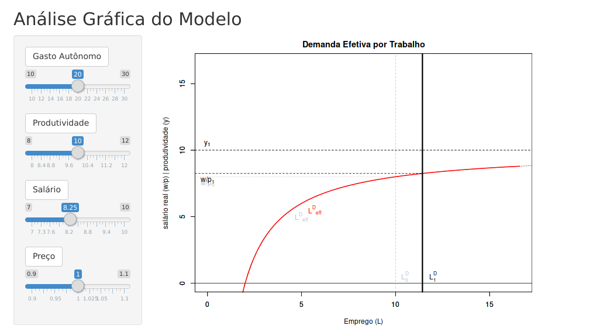

## Introdução

Este exercício tem como objetivo demonstrar o mecanismo de reação a choques exógenos da versão Kaleckiana do modelo macroeconômico, com enfoque no mercado de trabalho, fundamentada na escola pós-Keynesiana como apresentado por Lavoie (2014, Cap. 5.3, p. 291 - 315). 

Assim como no livro (ibd, p. 291 e 296), neste estudo pressupõem-se  

- uma economia fechada
- e sem governo,
- investimento como único gasto autônomo,
- assalariados consomem a renda em sua totalidade,
- inexistência de estoques,
- custo marginal constante (até atingir a plena capacidade),
- coeficientes técnicos de produção constantes,
- trabalho e capital não substituíveis,
- nível de emprego flexível até no curto prazo,
    - pois se assume um certo grau de capacidade ociosa, e assim sendo, pode se empregar mais ou 
      empregar menos a depender do nível de demanda (ibd, p. 292).

## Exemplo

[Clique aqui](https://mavila.shinyapps.io/Kalecki/) para testar versão interativa do modelo.

